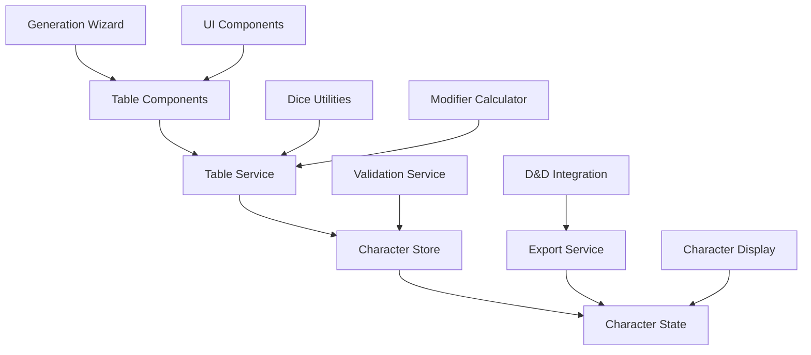

# Design Document

## Overview

The Central Casting D&D 3.5 Background Generator is a sophisticated React + TypeScript application that implements the complete Central Casting table system through a modular, extensible architecture. The system processes 8 major table categories (100s-800s) with complex cross-references, conditional logic, and character state management, providing both guided wizard-style generation and flexible manual table selection.

The architecture emphasizes clean separation of concerns with distinct layers for data management (table definitions), business logic (character state and table resolution), UI components (table displays and generation wizard), and integration services (D&D 3.5 export and character sheet formatting).

## Steering Document Alignment

### Technical Standards
Following modern React best practices with TypeScript for type safety, Zustand for predictable state management, and modular component architecture. The design emphasizes performance through efficient data structures and minimal re-renders.

### Project Structure
Implementing the comprehensive folder structure outlined in the project specification, with clear separation between UI components, business logic, data definitions, and utility functions.

## Code Reuse Analysis

### Existing Components to Leverage
Since this is a new project, we'll establish foundational patterns that can be reused throughout:
- **Base UI Components**: Button, Card, Modal, Table components for consistent styling
- **Dice Rolling System**: Centralized dice utilities for all table interactions
- **Character State Management**: Single source of truth for character data with computed properties
- **Table Engine**: Generic table processing logic that works across all 8 table categories

### Integration Points
- **Local Storage**: Character persistence and generation history
- **Export System**: D&D 3.5 character sheet formatting and file generation
- **Validation Layer**: Consistent data validation across all character attributes

## Architecture

The application follows a layered architecture with clear separation of concerns:

### Modular Design Principles
- **Single File Responsibility**: Each table component handles one specific table category
- **Component Isolation**: UI components are purely presentational, business logic in custom hooks
- **Service Layer Separation**: Data access through dedicated services, state management through Zustand stores
- **Utility Modularity**: Focused utilities for dice rolling, table resolution, character export, and validation



### State Management Architecture
- **Character Store (Zustand)**: Central character state with computed modifiers and real-time updates
- **Generation Store (Zustand)**: Wizard progress, completed steps, and navigation state
- **Settings Store (Zustand)**: UI preferences, generation modes, and application configuration

### Table Processing Pipeline
1. **Table Selection**: User chooses table or system navigates via cross-reference
2. **Modifier Calculation**: Apply CuMod, SolMod, BiMod, and other situational modifiers
3. **Dice Rolling**: Execute appropriate dice type with modifiers
4. **Result Resolution**: Find matching table entry and process effects
5. **State Update**: Update character attributes, modifiers, and history
6. **Navigation**: Process goto instructions or continue wizard flow

## Components and Interfaces

### Core Engine Components

#### TableEngine
- **Purpose:** Generic table processing engine that handles all 8 table categories
- **Interfaces:** `processTable(tableId, character, options)`, `resolveEntry(entry, character)`
- **Dependencies:** DiceService, ModifierCalculator, ValidationService
- **Reuses:** Pure function design for predictable table resolution

#### CharacterStateManager
- **Purpose:** Centralized character state with computed properties and validation
- **Interfaces:** `updateCharacter(updates)`, `addEvent(event)`, `calculateModifiers()`
- **Dependencies:** ValidationService, ModifierCalculator
- **Reuses:** Zustand store patterns for predictable state updates

#### GenerationWizard
- **Purpose:** Orchestrates step-by-step character generation flow
- **Interfaces:** `nextStep()`, `previousStep()`, `jumpToStep(stepId)`
- **Dependencies:** TableEngine, CharacterStateManager, NavigationService
- **Reuses:** React hook patterns for component logic separation

### Table Category Components

#### HeritageAndBirthTables (100s)
- **Purpose:** Handles race, culture, social status, and birth circumstances
- **Interfaces:** `RaceTable`, `CultureTable`, `SocialStatusTable`, `BirthTable`
- **Dependencies:** TableEngine, ModifierCalculator
- **Reuses:** Base table component patterns for consistent UI

#### YouthEventsTables (200s)
- **Purpose:** Processes childhood and adolescence events with personality development
- **Interfaces:** `YouthEventsTable`, `ChildhoodEventProcessor`, `AdolescenceEventProcessor`
- **Dependencies:** TableEngine, PersonalityTraitManager, AgeCalculator
- **Reuses:** Event processing patterns for consistent trait assignment

#### OccupationsTables (300s)
- **Purpose:** Manages apprenticeships, occupations, hobbies, and skill development
- **Interfaces:** `ApprenticeshipTable`, `OccupationTable`, `HobbyTable`
- **Dependencies:** TableEngine, SkillCalculator, CultureFilter
- **Reuses:** Skill rank calculation utilities across all occupation types

#### AdulthoodEventsTables (400s)
- **Purpose:** Processes significant adult life events and relationship formation
- **Interfaces:** `AdulthoodEventsTable`, `CompanionGenerator`, `RelationshipManager`
- **Dependencies:** TableEngine, NPCGenerator, EventProcessor
- **Reuses:** Event processing patterns from youth events with adult complexity

#### PersonalityTables (500s)
- **Purpose:** Determines values, alignment, and personality trait distribution
- **Interfaces:** `ValuesTable`, `AlignmentTable`, `PersonalityTraitsTable`
- **Dependencies:** TableEngine, TraitCategorizer, AlignmentCalculator
- **Reuses:** Trait management utilities for consistent personality tracking

#### MiscellaneousEventsTables (600s)
- **Purpose:** Handles unusual events, tragedies, wonderful events, and specialized experiences
- **Interfaces:** `UnusualEventsTable`, `TragedyTable`, `WonderfulEventsTable`, `SpecializedExperienceTable`
- **Dependencies:** TableEngine, ComplexEventProcessor, SubtableNavigator
- **Reuses:** Event processing with enhanced subtable navigation capabilities

#### ContactsTables (700s)
- **Purpose:** Generates NPCs, companions, rivals, and relationship networks
- **Interfaces:** `NPCTable`, `CompanionsTable`, `RivalsTable`
- **Dependencies:** TableEngine, NPCGenerator, RelationshipBuilder
- **Reuses:** Character generation patterns for consistent NPC creation

#### SpecialItemsTables (800s)
- **Purpose:** Manages gifts, legacies, magical items, and unique possessions
- **Interfaces:** `GiftsTable`, `LegaciesTable`, `MagicalItemsTable`
- **Dependencies:** TableEngine, ItemGenerator, PropertyManager
- **Reuses:** Item generation utilities for consistent magical item handling

### UI Components

#### DiceRollComponent
- **Purpose:** Interactive dice rolling with visual feedback and modifier display
- **Interfaces:** `rollDice(diceType, modifiers)`, `showRollHistory()`
- **Dependencies:** DiceService, AnimationLibrary
- **Reuses:** Consistent dice rolling interface across all tables

#### CharacterSheetPreview
- **Purpose:** Real-time character sheet display with D&D 3.5 formatting
- **Interfaces:** `renderCharacterSheet()`, `exportToPDF()`, `exportToJSON()`
- **Dependencies:** CharacterStateManager, ExportService
- **Reuses:** Character display patterns for consistent formatting

#### TableNavigationComponent
- **Purpose:** Handles table cross-references and navigation flow
- **Interfaces:** `navigateToTable(tableId)`, `handleGotoReference(reference)`
- **Dependencies:** TableService, NavigationHistory
- **Reuses:** Navigation patterns for consistent table jumping

## Data Models

### Character Model
```typescript
interface Character {
  // Core Identity
  id: string
  name: string
  age: number
  
  // Heritage & Birth (100s)
  race: Race
  culture: Culture
  socialStatus: SocialStatus
  birthCircumstances: BirthCircumstances
  family: Family
  
  // Life Events
  youthEvents: Event[]          // 200s
  adulthoodEvents: Event[]      // 400s
  miscellaneousEvents: Event[]  // 600s
  
  // Skills & Occupations (300s)
  occupations: Occupation[]
  apprenticeships: Apprenticeship[]
  hobbies: Hobby[]
  skills: Skill[]
  
  // Personality (500s)
  values: Values
  alignment: Alignment
  personalityTraits: PersonalityTraits
  
  // Relationships (700s)
  npcs: NPC[]
  companions: Companion[]
  rivals: Rival[]
  relationships: Relationship[]
  
  // Special Items (800s)
  gifts: Gift[]
  legacies: Legacy[]
  specialItems: SpecialItem[]
  
  // System Data
  activeModifiers: Modifiers
  generationHistory: GenerationStep[]
  dndIntegration: DDStats
}
```

### Table System Models
```typescript
interface Table {
  id: string
  name: string
  category: TableCategory // 100s, 200s, 300s, 400s, 500s, 600s, 700s, 800s
  diceType: DiceType
  modifier?: ModifierKey
  instructions?: string
  entries: TableEntry[]
  subtables?: Table[]
  conditions?: TableCondition[]
}

interface TableEntry {
  id: string
  rollRange: [number, number]
  result: string
  description?: string
  effects?: Effect[]
  goto?: string
  personalityTrait?: PersonalityTraitType
  conditions?: Condition[]
  subtableReference?: string
}
```

### Event System Models
```typescript
interface Event {
  id: string
  name: string
  description: string
  category: EventCategory // Youth, Adulthood, Miscellaneous
  period: LifePeriod // Childhood, Adolescence, Adult
  age?: number
  effects: Effect[]
  personalityTrait?: PersonalityTraitType
  relationships?: RelationshipEffect[]
  items?: ItemEffect[]
  tableSource: string
}

interface Effect {
  type: 'modifier' | 'trait' | 'skill' | 'item' | 'relationship' | 'occupation'
  target: string
  value: any
  duration?: 'permanent' | 'temporary'
  condition?: string
}
```

### Relationship Models
```typescript
interface NPC {
  id: string
  name: string
  type: NPCType
  occupation?: Occupation
  personality: PersonalityTraits
  appearance: string[]
  background: string
  relationship: RelationshipDetails
  abilities?: string[]
  significance: 'Minor' | 'Major' | 'Critical'
}

interface RelationshipDetails {
  type: RelationshipType
  strength: RelationshipStrength
  history: string
  currentStatus: string
  obligations?: string[]
  benefits?: string[]
}
```

## Error Handling

### Error Scenarios

1. **Invalid Table Reference**
   - **Handling:** Validate all table references during initialization, fallback to error table
   - **User Impact:** Clear error message with suggestion to restart generation

2. **Modifier Calculation Overflow**
   - **Handling:** Clamp modifiers to reasonable ranges (-20 to +20), log warnings
   - **User Impact:** Notification of clamped modifier with explanation

3. **Missing Subtable Data**
   - **Handling:** Graceful fallback to parent table or skip with notification
   - **User Impact:** Informative message about skipped subtable with alternative options

4. **Character State Corruption**
   - **Handling:** State validation with automatic repair or fresh start option
   - **User Impact:** Option to restore from backup or restart with notification

5. **Export Format Errors**
   - **Handling:** Validation before export with specific error reporting
   - **User Impact:** Clear indication of data issues preventing export with fix suggestions

## Testing Strategy

### Unit Testing
- **Table Engine**: Test all dice types, modifier calculations, and result resolution
- **Character State**: Validate state updates, modifier calculations, and data integrity
- **Data Models**: Test all TypeScript interfaces and validation functions
- **Utility Functions**: Comprehensive testing of dice rolling, validation, and export utilities

### Integration Testing
- **Table Navigation**: Test cross-references and goto functionality across all table categories
- **Character Generation Flow**: End-to-end generation through all 8 table categories
- **State Persistence**: Test localStorage integration and character restoration
- **Export Integration**: Validate D&D 3.5 export format and character sheet generation

### End-to-End Testing
- **Complete Character Generation**: Full character creation from start to finish
- **Complex Table Sequences**: Test intricate table cross-references and conditional logic
- **User Journey Testing**: Validate wizard flow, manual selection, and mixed generation modes
- **Export and Import**: Test full character export/import cycles with data integrity verification

### Performance Testing
- **Table Lookup Performance**: Ensure sub-100ms response for all table operations
- **Character State Updates**: Validate real-time UI updates stay under 200ms
- **Memory Usage**: Monitor memory consumption during extended generation sessions
- **Large Character Data**: Test performance with characters having extensive background data

## Technology Implementation Details

### State Management Architecture
- **Zustand Stores**: Three separate stores for character data, generation flow, and settings
- **Computed Properties**: Real-time modifier calculations and derived character attributes
- **Persistence Layer**: Automatic localStorage backup with manual save/load options

### Table Data Structure
- **JSON-based Tables**: Structured table definitions with TypeScript validation
- **Lazy Loading**: Tables loaded on-demand to optimize initial application load
- **Caching Strategy**: Intelligent caching of frequently accessed tables and computed results

### UI Framework Integration
- **React Hook Patterns**: Custom hooks for table processing, character management, and dice rolling
- **Component Composition**: Flexible table components that adapt to different table structures
- **Animation Framework**: Smooth transitions for table navigation and dice rolling feedback

### Export System Architecture
- **Multiple Format Support**: JSON, PDF, and D&D 3.5 character sheet formats
- **Template System**: Configurable export templates for different character sheet styles
- **Data Validation**: Comprehensive validation before export with error reporting and correction suggestions