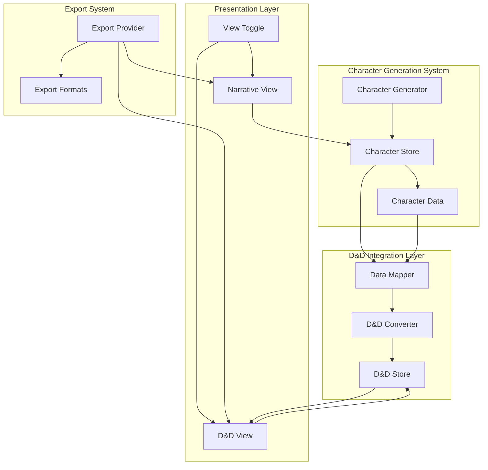
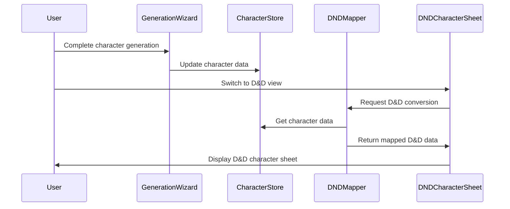
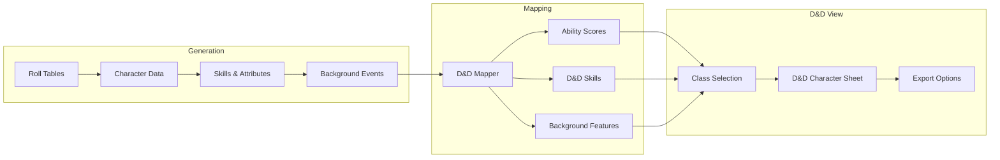

# Design: D&D 3.5 Character Sheet Integration

## Project Overview

This design outlines the technical architecture for integrating the existing D&D 3.5 character sheet functionality with the main character generation system, creating a seamless transition between narrative character creation and game-ready D&D character sheets.

## Code Reuse Analysis

### Existing D&D Components to Leverage
- **src/components/dnd/DNDCharacterSheet.tsx** - Complete D&D 3.5 character sheet interface with ability scores, skills, and class features
- **src/components/dnd/ClassSelector.tsx** - Class selection component with suitability assessment
- **src/components/dnd/SkillSheet.tsx** - D&D skill management functionality
- **src/data/dndClasses.ts** - Complete D&D 3.5 class definitions and data
- **src/data/dndSkills.ts** - D&D skill system and calculations
- **src/stores/characterStore.ts** - Existing character state management with D&D integration hooks

### Existing Infrastructure to Extend
- **Character Store**: Already includes `dndIntegration` field and D&D-specific methods
- **Character Types**: `src/types/character.ts` already has D&D ability scores and character class fields
- **Generation Wizard**: Can be extended to include D&D class selection step
- **UI Components**: Existing Card, Button, Badge components for consistent styling

## System Architecture

### High-Level Architecture


### Component Integration Flow


## Core Components

### 1. D&D Data Mapping Service
**File**: `src/services/dndMappingService.ts`

```typescript
export interface DNDMappingService {
  // Ability score mapping
  mapAttributesToAbilities(character: Character): AbilityScores
  
  // Skill translation
  mapSkillsToDNDSkills(skills: Skill[]): DNDSkill[]
  
  // Background conversion
  generateDNDBackground(character: Character): DNDBackground
  
  // Class recommendation
  recommendClasses(character: Character): ClassRecommendation[]
  
  // Complete character conversion
  convertToDNDCharacter(character: Character): DNDCharacter
}
```

**Key Features**:
- Maps generated character attributes to D&D ability scores using configurable algorithms
- Translates narrative skills to D&D 3.5 skill equivalents
- Generates D&D background features from character history
- Provides class recommendations based on ability scores and character background

### 2. Enhanced Character Navigation
**File**: `src/components/character/CharacterViewToggle.tsx`

```typescript
export interface CharacterViewToggleProps {
  currentView: 'narrative' | 'dnd'
  onViewChange: (view: 'narrative' | 'dnd') => void
  character: Character
  showDNDAvailable?: boolean
}
```

**Integration Points**:
- Add to existing CharacterSheet component
- Include in ComprehensiveCharacterSheet
- Integrate with export panel

### 3. D&D Character View Container
**File**: `src/components/character/DNDCharacterView.tsx`

```typescript
export interface DNDCharacterViewProps {
  character: Character
  onCharacterUpdate?: (updates: Partial<Character>) => void
  readOnly?: boolean
}
```

**Features**:
- Wraps existing DNDCharacterSheet component
- Handles data conversion and mapping
- Manages D&D-specific state changes
- Provides export functionality

### 4. Integrated Export System
**File**: `src/components/export/CharacterExportPanel.tsx`

```typescript
export interface ExportFormat {
  id: string
  name: string
  description: string
  icon: string
  handler: (character: Character) => void
}

export const EXPORT_FORMATS: ExportFormat[] = [
  {
    id: 'narrative-json',
    name: 'Narrative JSON',
    description: 'Complete character data',
    handler: exportNarrativeJSON
  },
  {
    id: 'dnd-sheet',
    name: 'D&D 3.5 Character Sheet',
    description: 'Game-ready character sheet',
    handler: exportDNDSheet
  },
  // ... other formats
]
```

### 5. Generation Wizard Integration
**Enhancement to**: `src/components/wizard/GenerationWizard.tsx`

**New Step Addition**:
```typescript
{
  id: 'dnd-class',
  title: 'D&D Class Selection',
  description: 'Choose your character class for D&D 3.5',
  icon: '⚔️',
  component: ClassSelector,
  optional: true
}
```

## Data Models and Interfaces

### Enhanced Character Type Extensions
**File**: `src/types/dnd.ts` (already exists, extend as needed)

```typescript
export interface DNDCharacterData {
  // Core D&D data
  abilityScores: AbilityScores
  characterClass?: DNDClass
  level: number
  
  // Computed values
  hitPoints: number
  armorClass: number
  baseAttackBonus: number
  savingThrows: SavingThrows
  
  // Skills and abilities
  skills: DNDSkill[]
  feats: Feat[]
  spells?: Spell[]
  
  // Equipment and gear
  equipment: Equipment[]
  wealth: number
  
  // Background integration
  background: DNDBackground
  traits: CharacterTrait[]
  flaws: CharacterFlaw[]
}

export interface AbilityScoreMapping {
  source: string // Which generated attribute/modifier this came from
  value: number
  modifier: number
  explanation: string
}
```

### Skill Mapping Configuration
**File**: `src/data/skillMappings.ts`

```typescript
export interface SkillMapping {
  narrativeSkill: string
  dndSkill: string
  conversionRatio: number
  notes?: string
}

export const SKILL_MAPPINGS: SkillMapping[] = [
  {
    narrativeSkill: 'Weaponsmithing',
    dndSkill: 'Craft (Weaponsmithing)',
    conversionRatio: 1.0
  },
  {
    narrativeSkill: 'Leadership',
    dndSkill: 'Diplomacy',
    conversionRatio: 0.8,
    notes: 'Partial mapping - Leadership is broader than Diplomacy'
  },
  // ... more mappings
]
```

## Integration Points

### 1. Character Store Enhancement
**Leverage**: Existing `updateDNDStats` and `calculateDNDModifiers` methods

**Extensions Needed**:
```typescript
// Add to CharacterStore interface
interface CharacterStore {
  // ... existing methods
  
  // D&D Integration
  mapToDNDCharacter: () => DNDCharacterData | null
  updateDNDCharacterClass: (characterClass: DNDClass) => void
  getDNDViewData: () => DNDCharacterData | null
  syncNarrativeToDND: () => void
  syncDNDToNarrative: (dndData: Partial<DNDCharacterData>) => void
}
```

### 2. Navigation Integration
**Leverage**: Existing tab system in CharacterSheet component

**Enhancement Strategy**:
- Add "D&D 3.5" tab to existing tab navigation
- Maintain existing tab styling and behavior
- Add view state to character store for persistence

### 3. Export System Integration
**Leverage**: Existing export functionality in CharacterSheet

**Enhancement Strategy**:
- Extend existing export tab with new format options
- Reuse existing modal/popup patterns
- Integrate with existing download mechanisms

## User Interface Design

### 1. View Toggle Component
**Location**: Top of character sheet, next to character name

**Design**:
- Segmented control: "Narrative" | "D&D 3.5"
- Clear visual indication of current view
- Smooth transition between views
- Maintains all navigation and export functionality

### 2. D&D Character Sheet Layout
**Leverage**: Existing DNDCharacterSheet component layout

**Enhancements**:
- Add "Converted from Narrative" indicators
- Show mapping explanations on hover/click
- Highlight auto-generated vs. user-selected data
- Maintain existing responsive design

### 3. Export Panel Updates
**Design**:
```
Export Options:
┌─────────────────────────────────────┐
│ 📄 Narrative JSON                   │
│ Complete character data             │
└─────────────────────────────────────┘
┌─────────────────────────────────────┐
│ 🎲 D&D 3.5 Character Sheet         │
│ Game-ready character sheet          │
└─────────────────────────────────────┘
┌─────────────────────────────────────┐
│ 📝 Character Summary                │
│ Readable character description      │
└─────────────────────────────────────┘
```

## Data Flow Architecture

### 1. Character Generation to D&D Flow


### 2. Bidirectional Sync Strategy
**Challenge**: Allow D&D modifications without breaking narrative integrity

**Solution**:
- D&D view changes affect only D&D-specific fields
- Core narrative data remains immutable in D&D view
- Clear separation between generated and user-modified data
- Sync warnings when D&D changes conflict with narrative data

## Error Handling Strategy

### 1. Conversion Failures
**Scenarios**:
- Character missing required data for D&D conversion
- Skill mappings not found
- Invalid ability score distributions

**Handling**:
- Graceful fallbacks to default values
- Clear error messages with suggested fixes
- Partial conversion with warnings
- Option to continue with incomplete data

### 2. Data Inconsistency
**Scenarios**:
- User modifies D&D data that conflicts with narrative
- Class requirements not met by ability scores
- Skill point allocation exceeds limits

**Handling**:
- Warning indicators in UI
- Validation messages with explanations
- Suggestions for resolution
- Option to reset to auto-generated values

## Performance Considerations

### 1. Data Conversion Optimization
**Strategy**:
- Lazy conversion - only convert when D&D view is accessed
- Memoization of conversion results
- Incremental updates for character changes
- Background conversion for smoother UX

### 2. Component Loading
**Strategy**:
- Code splitting for D&D components
- Lazy loading of D&D view
- Preload conversion data on character completion
- Efficient state management updates

## Testing Strategy

### 1. Conversion Accuracy Testing
**Test Categories**:
- Ability score mapping validation
- Skill translation accuracy
- Class recommendation logic
- Background feature generation

### 2. Integration Testing
**Test Scenarios**:
- Complete character generation to D&D view flow
- View switching functionality
- Export functionality from both views
- Data persistence across sessions

### 3. User Experience Testing
**Focus Areas**:
- Transition smoothness between views
- Clarity of auto-generated vs. user data
- Export format usability
- Error recovery flows

## Migration and Compatibility

### 1. Existing Character Support
**Strategy**:
- All existing characters must be convertible to D&D view
- Missing data fields get reasonable defaults
- Conversion logs for transparency
- Option to update/enhance old character data

### 2. Backward Compatibility
**Requirements**:
- No breaking changes to existing character store API
- Existing components continue to function unchanged
- New D&D functionality is additive only
- Graceful degradation for unsupported features

## Security and Data Integrity

### 1. Data Validation
**Measures**:
- Validate all D&D conversions against rules
- Ensure ability scores stay within valid ranges
- Validate skill point allocations
- Check class prerequisites

### 2. State Management
**Safety**:
- Immutable updates to character data
- Transaction-like updates for complex changes
- Rollback capability for failed operations
- Data consistency checks

## Future Extensibility

### 1. Additional D&D Editions
**Design Considerations**:
- Modular conversion system
- Edition-specific mappers
- Configurable rule sets
- Shared base components

### 2. Other Game Systems
**Architecture Support**:
- Generic character conversion framework
- Pluggable mapping services
- Extensible export system
- Reusable UI patterns

## Implementation Priority

### Phase 1: Core Integration (High Priority)
1. Create D&D mapping service
2. Add view toggle to character sheet
3. Integrate existing DNDCharacterSheet component
4. Basic export functionality

### Phase 2: Enhanced Features (Medium Priority)
1. Class recommendations
2. Advanced skill mapping
3. Background feature generation
4. Export format expansion

### Phase 3: Polish & Optimization (Low Priority)
1. Performance optimizations
2. Advanced error handling
3. Enhanced UI/UX
4. Comprehensive testing

This design leverages the substantial existing D&D infrastructure while creating a seamless integration that enhances rather than disrupts the current character generation workflow.